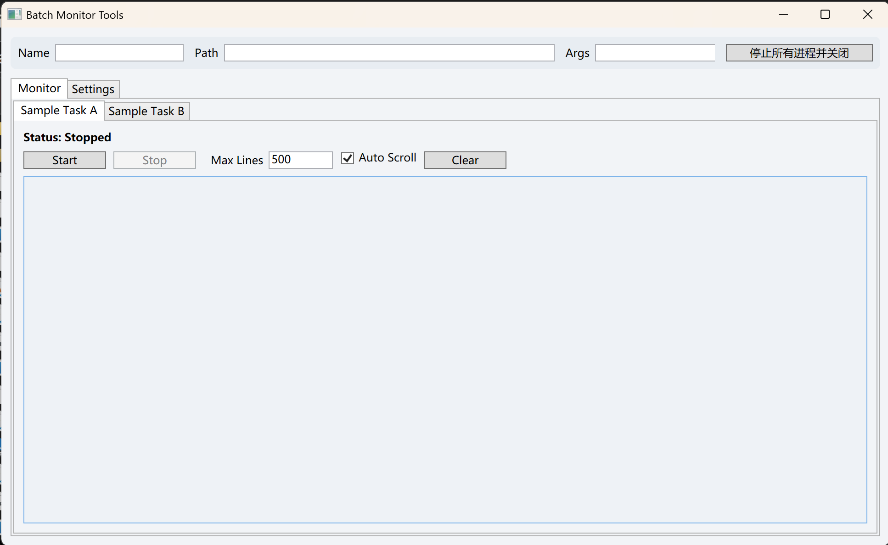
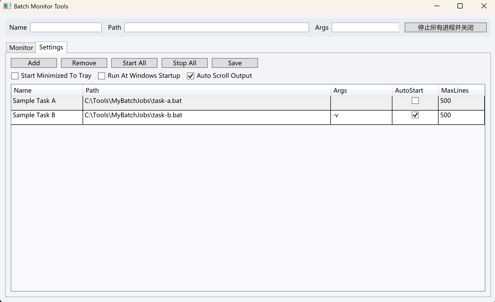

# Batch Monitor Tools

轻量级 WPF 工具，用于运行与监控多个批处理任务，支持实时输出、托盘运行及可配置启动行为。  
A lightweight WPF utility to run and monitor multiple batch files, with live output, tray support, and configurable startup behavior.
Version: v1.0.6 / 版本：v1.0.6

## Requirements / 运行要求
- Windows 10/11
- .NET 8 SDK (for building/running from source) / .NET 8 SDK（用于源码编译运行）

## Features / 功能概述
- Run multiple batch tasks with live stdout/stderr output / 多任务运行与实时输出
- Start/stop individual tasks, or start/stop all tasks / 单个或批量启动/停止
- Max output lines and clear output per task / 输出行数限制与清空
- Output search/filter with shared input, plus match navigation / 输出搜索与过滤（共享输入框，支持命中导航）
- Keyword highlight for output lines / 输出关键词高亮显示
- Multi-select output lines with Ctrl/Shift and copy via Ctrl+C or context menu / Ctrl/Shift 多选输出行，支持 Ctrl+C 或右键菜单复制
- Graceful batch stop flow: sends Ctrl+C and auto-confirms batch termination before forced kill fallback / 任务停止优先发送 Ctrl+C 并自动确认批处理终止，超时后再强制结束
- Per-task input redirect toggle in Settings for tools that reject redirected stdin / 设置页支持任务级输入重定向开关，适配拒绝 stdin 重定向的程序
- Safe stop fallback for tasks with input redirect disabled / 输入重定向关闭的任务在停止时走安全兜底，避免 Ctrl+C 侧影响
- Minimize to tray and optional start minimized / 最小化到托盘与启动最小化
- Optional run at Windows startup (HKCU Run key) / 可选开机自启（HKCU Run）
- Settings UI for editing task configuration / UI化配置任务

## Screenshots / 截图



## Getting started / 快速开始
1) Copy the example config and edit it / 复制示例配置并修改：
```json
// from repo root
// copy src/config.example.json to src/config.json
```
2) Update each task path/args in `src/config.json` / 更新任务路径与参数  
3) Run / 运行：
```bash
cd src
dotnet run
```

## Configuration / 配置说明
`src/config.json` controls tasks and app-level settings / 用于任务与应用设置：
- `tasks`: list of batch jobs to run / 任务列表
  - task fields include `enableInputRedirect` (default `true`) / 任务字段包含 `enableInputRedirect`（默认 `true`）
- `startMinimizedToTray`: start hidden and show tray icon / 启动最小化到托盘
- `runAtWindowsStartup`: register in HKCU Run key / 注册开机自启
- `autoScrollOutput`: auto-scroll output on updates / 输出自动滚动

## Notes / 备注
- If you enable "Run At Windows Startup", the app registers itself under
  `HKCU\Software\Microsoft\Windows\CurrentVersion\Run`.  
  启用开机自启后会写入 `HKCU\Software\Microsoft\Windows\CurrentVersion\Run`。

## Docs / 文档
- Architecture overview / 架构说明: docs/architecture.md
- Session history / 会话历史: docs/history.md

荣耀归于CODEX！
